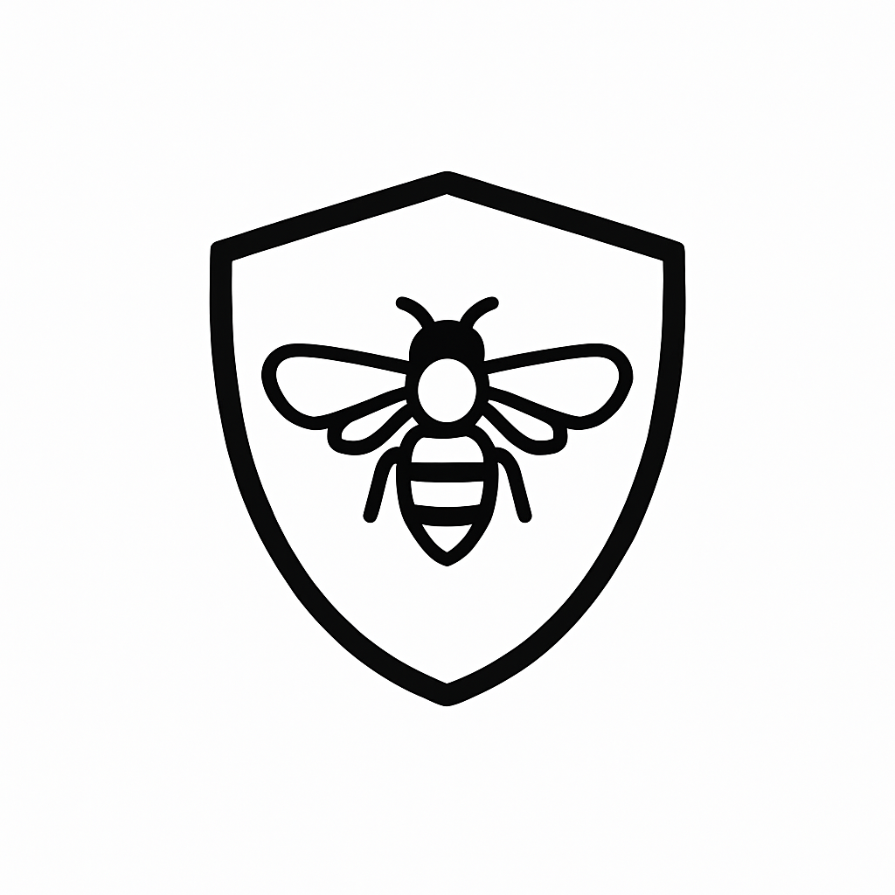

<div align="center">



# Insect Security Scanner

[](https://badge.fury.io/py/insect)
[](https://pypi.org/project/insect/)
[](https://opensource.org/licenses/MIT)
[](https://github.com/somasays/insect/actions)
[](https://github.com/somasays/insect/actions)

</div>

**Insect** is a security-focused command line tool designed to scan Git repositories for potentially malicious code patterns before execution. It uses a combination of static analysis, configuration checks, and metadata examination to identify security risks in code.

> 🎉 **Now in Beta!** v0.1.5 brings a beautiful, responsive CLI interface with enhanced configurability.

## ✨ Features

- **🎨 Beautiful CLI Interface**: Rich, colorful, responsive design that adapts to any terminal size
- **🔍 Multi-language Support**: Python, JavaScript, Shell scripts, and more
- **🛡️ Deep Static Analysis**: Detects suspicious patterns and security vulnerabilities
- **🔧 External Tool Integration**: Works with Bandit, Semgrep, ShellCheck, and other security tools
- **📊 Detailed Reporting**: Text, JSON, and interactive HTML outputs with professional styling
- **⚡ Performance Optimization**: Smart caching for faster re-scanning
- **🎛️ Flexible Configuration**: Customize analysis sensitivity and rules based on project needs
- **🐳 Containerized Scanning**: Safe analysis of untrusted repositories in Docker containers

## Installation

```bash
pip install insect
```

Or using pipenv:

```bash
pipenv install insect
```

## 🚀 Quick Start

### Basic Scanning
```bash
# Scan current directory with beautiful UI
insect scan .

# Scan with high sensitivity for comprehensive analysis
insect scan . --sensitivity high

# Generate HTML report with detailed findings
insect scan . --format html --output security-report.html
```

### New in v0.1.5: Responsive CLI
The CLI automatically adapts to your terminal size:
- **Wide terminals**: Rich side-by-side layout with detailed information
- **Narrow terminals**: Stacked layout with smart text truncation
- **Progress bars**: Dynamic width adjustment for optimal viewing

### Sensitivity Levels
```bash
insect scan . --sensitivity low        # Only obvious security threats
insect scan . --sensitivity normal     # Standard detection (default)  
insect scan . --sensitivity high       # Include speculative findings
insect scan . --sensitivity very_high  # All patterns (unusual commits, etc.)
```

Check status of external dependencies:

```bash
insect deps
```

Generate a detailed HTML report:

```bash
insect scan /path/to/repository -f html -o report.html
```

Safely scan a repository in a container before cloning:

```bash
insect clone https://github.com/example/repository
```

## Development

### Setup

```bash
# Clone the repository
git clone https://github.com/yourusername/insect.git
cd insect

# Setup development environment
pipenv install --dev
pipenv shell

# Install pre-commit hooks
pre-commit install
```

### Testing

```bash
# Run tests
pytest

# Run tests with coverage
pytest --cov=insect

# Run tox to test across different Python versions
tox
```

### Code Quality

```bash
# Format code
black .
isort .

# Lint code
ruff .

# Type checking
mypy .
```

## Documentation

For comprehensive documentation, see our [documentation index](docs/README.md) or explore:

- [Usage Guide](docs/usage.md) - Detailed instructions on using Insect
- [Security Examples](docs/security_examples.md) - Examples of security issues Insect can detect
- [Advanced Usage](docs/advanced_usage.md) - Advanced usage and customization options
- [Container Scanning](docs/container_scanning.md) - Running Insect in Docker containers
- [Use Cases](docs/use_cases.md) - Real-world use cases and applications
- [Contributing](docs/contributing.md) - Guide for contributing to Insect

## Security Issues Insect Can Detect

Insect can detect a wide range of security issues, including:

- **Command Injection**: Unsafe command execution in Python, JavaScript, and Shell scripts
- **Cross-Site Scripting (XSS)**: DOM manipulation vulnerabilities in JavaScript
- **SQL Injection**: Unsafe SQL query construction
- **Hardcoded Secrets**: API keys, tokens, and credentials in code
- **Insecure Deserialization**: Unsafe deserialization of untrusted data
- **Path Traversal**: Directory traversal vulnerabilities
- **Obfuscated Code**: Base64 encoded payloads and suspicious patterns
- **Configuration Issues**: Insecure default settings and misconfigurations
- **Browser Data Theft**: Malicious code that attempts to steal browser data including:
  - Browser history and cookies access
  - Browser storage manipulation (localStorage, sessionStorage, indexedDB)
  - Browser session hijacking and cookie theft
  - Browser password extraction from password managers
  - Browser form data and autofill theft
  - Browser extension manipulation and injection
  - Browser cache access and data exfiltration
- **Cryptocurrency Wallet Theft**: Malicious code that attempts to steal cryptocurrency assets including:
  - Wallet file access patterns (wallet.dat, keystore files)
  - Private key extraction attempts
  - Seed phrase harvesting code
  - Suspicious crypto API interactions
  - Wallet address enumeration and scanning
  - Hardware wallet access attempts
  - Cryptocurrency stealer behavior (clipboard hijacking)
  - Exchange API abuse for unauthorized withdrawals
  - Unauthorized cryptocurrency mining

For examples of each type, see the [Security Examples](docs/security_examples.md) documentation.

## Development

Insect uses [tox](https://tox.readthedocs.io/) for managing development environments and running tests. The project uses [pipenv](https://pipenv.pypa.io/) for dependency management.

### Setup

1. Clone the repository:
   ```bash
   git clone https://github.com/somasays/insect.git
   cd insect
   ```

2. Install pipenv and dependencies:
   ```bash
   pip install pipenv
   pipenv install --dev
   ```

### Available Tox Environments

- **`tox -e all`** - Run all checks and tests (used in CI/CD)
- **`tox -e lint`** - Run only linting checks (ruff, black, isort)
- **`tox -e typecheck`** - Run only type checking (mypy)
- **`tox -e test`** - Run only tests with coverage
- **`tox -e dev`** - Quick development checks (lint + tests with fast failure)
- **`tox -e format`** - Auto-format code (black, isort)

### Development Workflow

1. **Quick feedback during development:**
   ```bash
   pipenv run tox -e dev
   ```

2. **Format code:**
   ```bash
   pipenv run tox -e format
   ```

3. **Run full test suite before committing:**
   ```bash
   pipenv run tox -e all
   ```

4. **Run specific tests:**
   ```bash
   pipenv run tox -e test -- tests/unit/test_specific.py
   ```

### Manual Commands (if needed)

If you prefer to run individual commands:

```bash
# Install dependencies
pipenv install --dev

# Run tests
pipenv run pytest tests/ --cov=insect

# Run linting
pipenv run ruff check src tests
pipenv run black --check src tests
pipenv run isort --check-only src tests

# Type checking
pipenv run mypy src tests

# Format code
pipenv run black src tests
pipenv run isort src tests
```

## License

MIT
