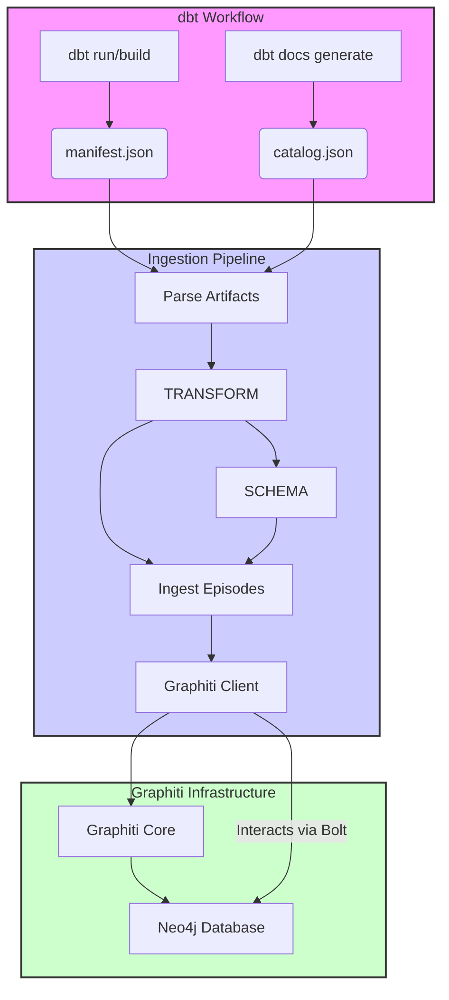

Okay, here is the content for `systemPatterns.md`, formatted as a markdown file:

# System Patterns: dbt Metadata Knowledge Graph

## 1. System Architecture Overview

The system consists of a Python-based pipeline designed to extract metadata from dbt artifacts and load it into a Graphiti knowledge graph instance (backed by Neo4j).

## 2. Key Design Patterns & Components

*   **Artifact Parsing:** Reads and parses standard dbt JSON artifacts (`manifest.json`, `catalog.json`) as the source of truth for metadata.
*   **Data Transformation:** Converts the nested structure of dbt artifacts into a flattened list of entities (Models, Columns, Sources, Tests) and their relationships, conforming to predefined schemas.
*   **Custom Schema Definition (Pydantic):** Uses Pydantic models within the Python code to explicitly define the structure and types of nodes (entities) expected in the Graphiti graph (e.g., `DbtModel`, `DbtColumn`). Graphiti supports defining custom entity types via Pydantic.
*   **Structured JSON Ingestion:** Leverages Graphiti's `EpisodeType.json` to ingest data that already conforms to the defined schemas, aiming for direct mapping rather than LLM-based extraction for this structured data. The behavior regarding skipping LLM extraction needs verification, as Pydantic integration with LLMs often focuses on guiding extraction or validating output.
*   **Bulk Loading:** Uses Graphiti's `add_episode_bulk` method for efficient ingestion of multiple dbt assets (represented as `RawEpisode` objects) in a single operation. Note: `add_episode_bulk` is noted to potentially skip edge invalidation, suitable for initial loads or when invalidation isn't critical.
*   **Graph Database Backend:** Relies on Neo4j as the underlying graph database managed by Graphiti.
*   **Temporal Modeling (Implicit):** Achieves temporal tracking by periodically running the entire ingestion pipeline. Graphiti's internal mechanisms handle the versioning of relationships (edges) based on the `reference_time` of the ingested episodes.
*   **Hybrid Search (Graphiti Feature):** Leverages Graphiti's built-in capabilities for combining semantic, keyword, and graph-based search once data is ingested.

## 3. Data Flow

1.  dbt commands (`dbt run`, `dbt docs generate`) produce `manifest.json` and `catalog.json`.
2.  The Python pipeline reads these two JSON files.
3.  Data is parsed, and relevant information for each dbt asset (model, column, source, etc.) is extracted and merged from both files.
4.  The merged data for each asset is transformed into a JSON object conforming to its corresponding Pydantic model (`DbtModel`, `DbtColumn`, etc.).
5.  Each transformed JSON object becomes the `content` of a `RawEpisode` dictionary, with `type` set to `EpisodeType.json` and a consistent `reference_time` (e.g., artifact generation time or pipeline run time).
6.  A list of these `RawEpisode` objects is passed to the Graphiti client's `add_episode_bulk` method.
7.  Graphiti processes the episodes, ideally creating/updating nodes and relationships in the Neo4j database based on the provided structured content and defined Pydantic types. Graphiti automatically handles embedding generation for searchable text fields (like descriptions).